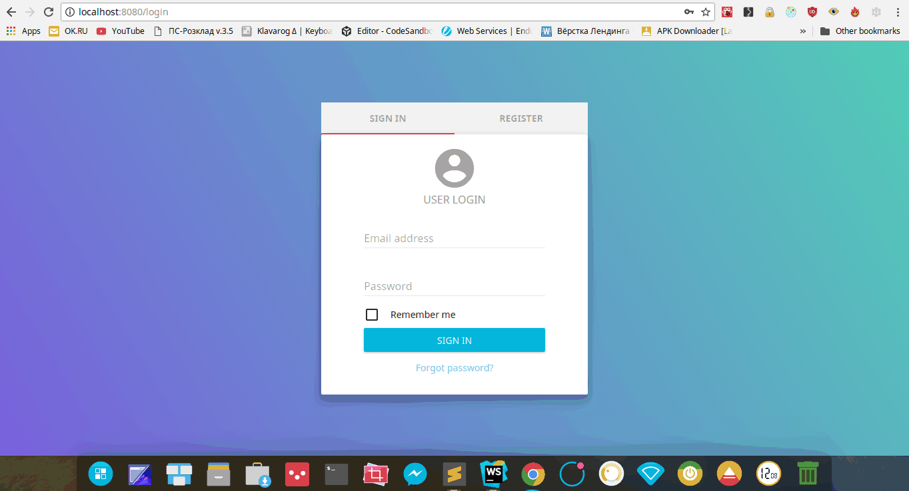

# react-admin-panel 
Simple react panel with login form.

### Instructions

### Installation
```
git clone https://github.com/FreAK19/react-admin-panel.git
yarn install        // install all dependencies
```
### Commands
```
yarn start      		//  open browser and go to localhost:8080
yarn build      		//  build production version
yarn lint      			//  eslinting
yarn flow      			//  check flow error
yarn flow-typed     //  install all flow-typed pkgs
yarn format      		//  prettier format for clean code
yarn test      			//  jest, enzyme test
yarn test:coverage  //  jest test coverage
```
